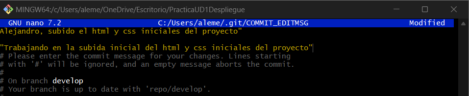

<h1> PRACTICA 1 </h1>
 
<h2> ¿Que es git> </h2>

 Git es un sistema de control de versiones que permite a los desarrolladores gestionar y rastrear cambios en el código fuente a lo largo del tiempo. 

 
<h2>¿En que consiste la metolodgia GitFlow?</h2>

GitFlow es una metodología de desarrollo basada en Git que organiza el trabajo en ramas, facilitando la colaboración y la gestión de versiones.

Se centra en un modelo de ramificación que incluye ramas principales como master (o main) y develop, así como ramas auxiliares para nuevas características (feature), correcciones de errores (hotfix) y versiones de producción (release).
 

Esta estructura permite un flujo de trabajo claro, donde se pueden desarrollar, probar y lanzar nuevas funcionalidades de manera ordenada, minimizando conflictos y asegurando la estabilidad del código en todo momento.

 
<h2>¿Porque hemos realizado el proyecto en GitFlow?</h2>

Hemos utilizado GitFlow ya que agiliza y distribuye la carga de trabajo a la hora de hacer proyectos

 
<h2> Trabajo </h2>

Vemos que iniciamos el flow init y lo subimos al remoto

 
 

Y vemos que se han creado las ramas en el Git

Hacemos el commit y creamos los features correspondientes, al final es ir implentando lo mismo pero viendo a ver que hacer cada usuario

En el tercer usuario haremos lo mismo pero el se encargara de hacer el release

Por ultimo el primer usuario se encargara de hacer unas mejoras a la pagina con hotfix

Y tambien de hacer un push

